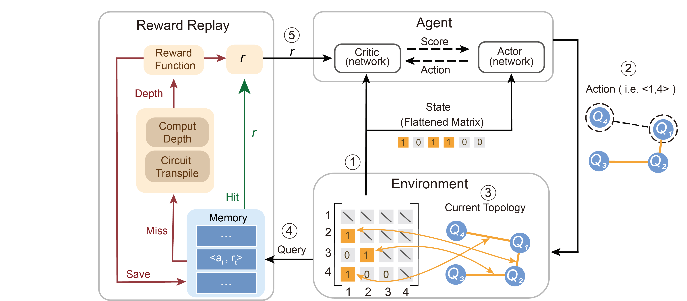
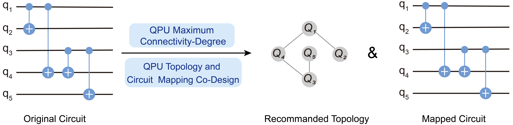
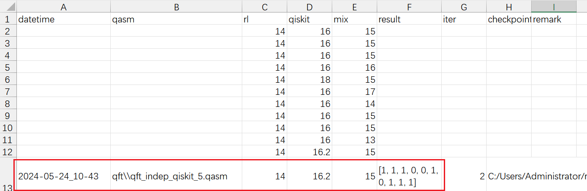
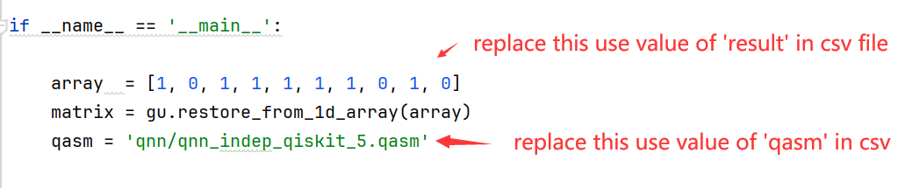

# AI-Powered Algorithm-Centric Quantum Processor Topology Design


## Introction

This repository is the official implementation of ***AI-Powered Algorithm-Centric Quantum Processor Topology Design.***     For any questions, please feel free to contact us(qclab_quantum@163.com) .




> *Overview architecture and workflow of OurProposed RR-PPO:  (1) The agent acquires state from the environment; state are represented by a flattened matrix that denotes the current topology, where $M_{ij} = 1$ indicates that $Q_i$ and $Q_j$ are connected. (2) Subsequently, the agent outputs an action ($a$), that determines  build an connection between which two qubits. (3) The action is then applied to the current topology. (4)}The action a is used as a key to query the reward ($r$) from memory, which stores pairs of $<a,r>$. If the action is found in memory, the corresponding reward  will be directly provided to the agent, else, an evaluation involving circuit transpilation and depth calculation is performed. The reward function then computes the reward based on the circuit depth, and this reward is subsequently stored in memory as pairs of $<a,r>$​​. (5) The agent receives the reward and continuation to the subsequent iteration.*

<hr/>



> Our study employs Reinforcement Learning model to suggest an topology that aligns with the circuit’s characteristics under the limitations imposed by restricted connectivity. Subsequently, qubits are mapped in a sequential manner instead of a complex mapping algorithms. Our approach yields a suggested topology and mapped circuit onto this proposed topology.

## Requirements

We recommend **Anaconda** as Python environment manager, and **Pytorch** as base environment

For Linux , you can  install Pytorch  by run:

```setup
pip3 install torch torchvision torchaudio --index-url https://download.pytorch.org/whl/cpu
```

Guide of install Pytorch on **Windows** or with GPU  is available at [Pytorch Get Started](https://pytorch.org/get-started/locally/)

## Get started

1. download code

```
git clone https://github.com/qclab-quantum/Qtailor.git
```

2. install requirements:

```setup
To create python environment with conda, use:
conda create --name qtailor python=3.10

To activate this environment, use:
conda activate qtailor

To install requirements, use:
pip install -r requirements.txt
```

## Configuration

you have the option to utilize the default settings or customize the important items in the config.xml :

```
# traing iterations
iters_arr
  - 5
  
# relative path of  store in benchmark folder
circuits:
  -qft\\qft_indep_qiskit_5.qasm
  
# about 0.5x the number of CPU cores, for laptop you can set to 4
num_rollout_workers: 4
```


## Training

To train the model, run this command:

```train
python rllib_run.py
```

>📋  When training complete the training result will be automatically saved in **benchmark/a-result/xxx.csv**.
> The column **'rl'** means the depth of mapped circuits results from our method, the column 'results'  results represents the lower left corner of the matrix , as we mention in **Section 2.1 (line 92)**

## Evaluation

To evaluate the result,

1. Open utils/benchmark.py  and modify the main function

```python
if __name__ == '__main__':

    array  = []

    qasm = 'portfolio_vqe/portfoliovqe_indep_qiskit_10.qasm'

    Benchmark.compare_gates(qasm=qasm,array=array,bits = 10)
```

2. Replace the existing values with those retrieved from the **benchmark/a-result/xxx.csv**. the csv file looks like:






3. Run the main Function in your editor , or  run:

   ```shell
   python utils/benchmark.py
   ```


## Results


>A comparative evaluation involving QTailor and Qiskit. The x-axis represents the circuit size quantified by the number of qubits, while the y-axis denotes the circuit depth after the mapping
>process:

<hr>

 

> Topology recommend for 40-bit Amplitude_Estimation circuits by RR-PPO model and a gird like layout for this topology.

## Acknowledgment
Our implementation is based on 

[Ray RLlib](https://github.com/ray-project/ray/tree/master/rllib) and [Pytorch]()
