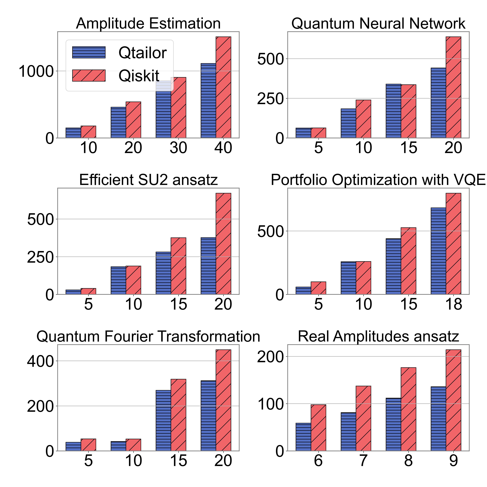

# AI-Powered Algorithm-Centric Quantum Processor Topology Design


## Message
This repository is the official implementation of ***AI-Powered Algorithm-Centric Quantum Processor Topology Design.*** For any questions, please feel free to contact us: 

He-Liang Huang (Corresponding author, quanhhl@ustc.edu.cn)

Tian Li(felix.litian@foxmail.com)

The full paper includes **Appendix**  is available at **assets**

## Introction


Overview of proposed Qtailor: (1) The agent acquires state from the environment; state are represented by a flattened matrix that denotes the current topology, where $M_{ij}$ = 1 indicates that $Q_i$ and $Q_j$ are connected. (2) Subsequently, the agent outputs an action (a), that establish an connection between which two qubits. (3) The action is then applied to the topology. (4) Using the action as a key, we query the reward (r) from memory, which stores pairs of < a, r >. If a match is found, the corresponding reward will be directly provided to the agent, otherwise, an evaluation involving circuit compilation, computation of depth, and gates is conducted. The reward function is then applied based on the depth or gates, and this reward is stored in memory as a pair of < a, r >. This process is referred to as reward replay, detailed in Section 2.2. (5) Finally, The agent receives the reward and continues to the subsequent iteration.
<hr/>


> Our study employs Reinforcement Learning model to suggest an topology that aligns with the circuit’s characteristics under the limitations imposed by restricted connectivity. Subsequently, qubits are mapped in a sequential manner instead of a complex mapping algorithms. Our approach yields a suggested topology and mapped circuit onto this proposed topology.


## Get started

1. download code

```
git clone https://github.com/qclab-quantum/Qtailor.git
```


2. install requirements:
We recommend **Anaconda** as Python package manager.
```setup
To create python environment with conda, use:
conda create --name qtailor python=3.10

To activate this environment, use:
conda activate qtailor

To install requirements, use:
pip install -r requirements.txt
```

The  **Pytorch**  package is also required, For **Windows**, the Pytorch  is already installed  by run "pip install -r requirements.txt":

For **Linux** or to install Pytorch with GPU,  please see [Pytorch Get Started](https://pytorch.org/get-started/locally/)


## Configuration

you have the option to utilize the default settings or customize the important items in the **config.xml** :

```
# traing iterations
iters_arr
  - 5
  
# relative path of  store in benchmark folder
circuits:
  -qft\\qft_indep_qiskit_5.qasm
  
# about 0.5 times the number of CPU cores, for laptop you can set to 4
num_rollout_workers: 4
```


## Training

To train the model, run this command:

```train
python run_v7.py
```

>📋  When training complete the training result will be automatically saved in **benchmark/a-result/xxx.csv**.
> The column **'rl'** means the depth of mapped circuits results from our method, the column 'results'  results represents the lower left corner of the matrix , as we mention in **Section 2.1 (line 92)**

## Evaluation

To evaluate the result,

1. Open utils/benchmark.py  and modify the main function

```python
    array = [1, 0, 1, 1, 0, 1, 0, 0, 0, 1, 0, 0, 1, 0, 1, 1, 0, 0, 0, 0, 1, 0, 1, 0, 0, 1, 0, 1, 0, 0, 1, 1, 0, 0, 0, 1, 0, 1, 0, 0, 1, 1, 0, 0, 1]
    matrix = gu.restore_from_1d_array(array)
    qasm = 'qnn/qnn_indep_qiskit_10.qasm'
    
    Benchmark.depth_benchmark(file_path='',matrix=matrix,qasm = qasm,draw = True,show_in_html=True)
```

2. Replace the existing values with those retrieved from the **benchmark/a-result/xxx.csv**. the csv file looks like:


3. Run the main function in IDE(i.e. Pycharm), or just excute in terminal :

   ```shell
   python utils/benchmark.py
   ```


## Results



>A comparative evaluation involving QTailor and Qiskit. The x-axis represents the circuit size quantified by the number of qubits, while the y-axis denotes the circuit depth after the mapping
>process:

<hr>

 

> Topology recommend for 40-bit Amplitude_Estimation circuits by RR-PPO model and a gird like layout for this topology.

## Acknowledgment
Our implementation is based on 

[Ray RLlib](https://github.com/ray-project/ray/tree/master/rllib) and [Pytorch]()


## Others

The code is available in both :

Github https://github.com/qclab-quantum/Qtailor 

and Gitee https://gitee.com/Eliment-li/qccrl


